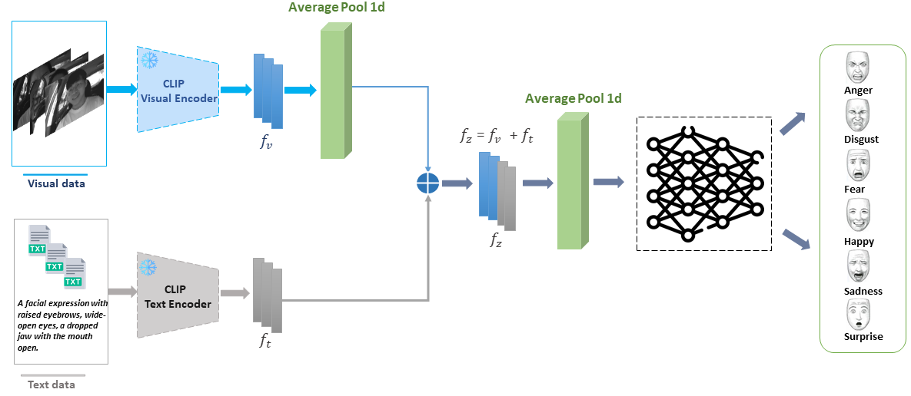
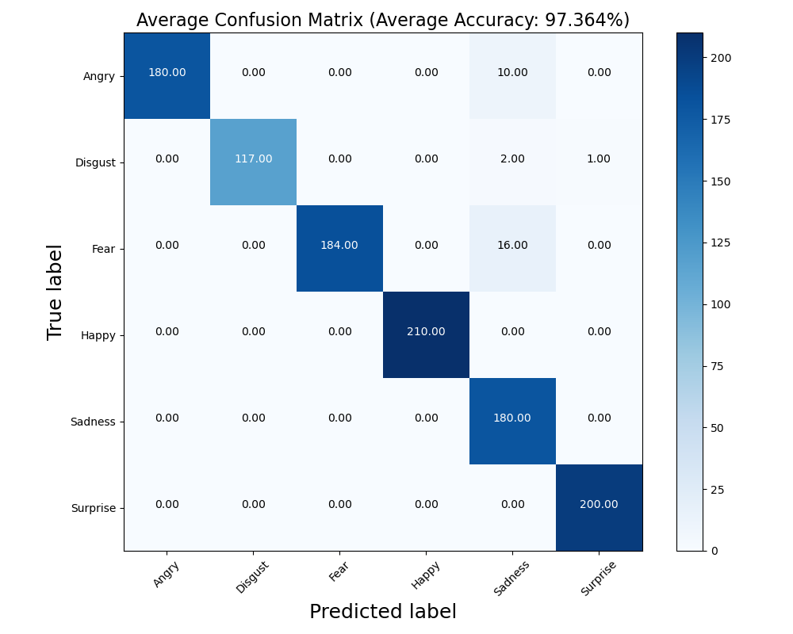
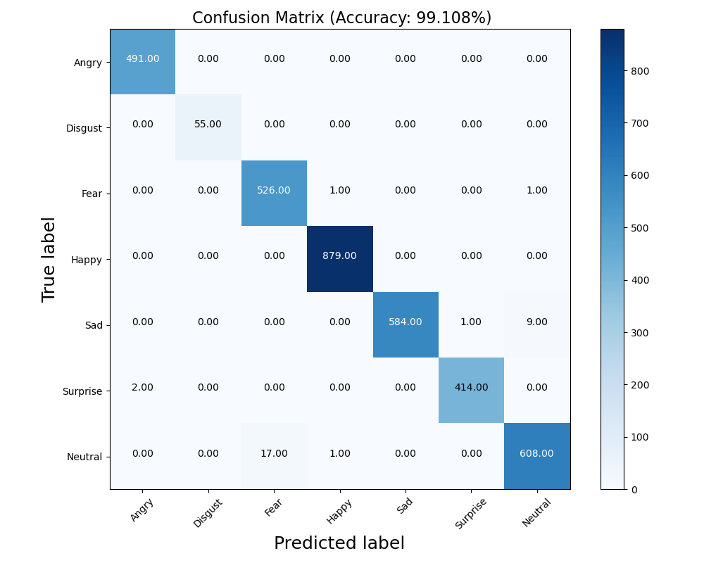
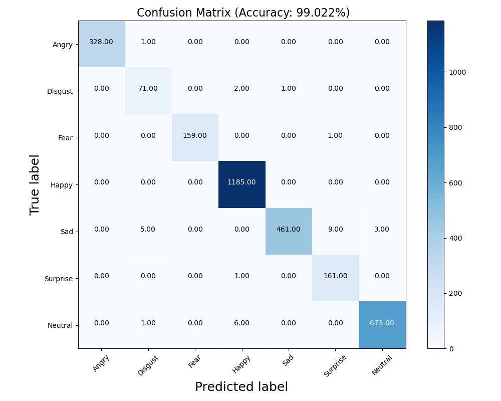

# CLIVP-FER:LEVERAGING VISION LANGUAGE MODELS FOR FACIAL EXPRESSION RECOGNITION
A CLIP based pytorch implementation on facial expression recognition (KMU-FED, FER2013, and RAF-DB), achieving an average accuracy of 97.36%  in KMU-FED, an accuracy of 99.01% and 99.22% in FER2013  and RAF-DB datasets(state-of-the-art)

This is the **official repository** for the [**paper**](https://arxiv.org/abs/) "*CLIVP-FER:LEVERAGING VISION LANGUAGE MODELS FOR FACIAL EXPRESSION RECOGNITION*".

# CLIVP-FER Architecture

## Datasets ##
- KMU-FED dataset from https://cvpr.kmu.ac.kr/KMU-FED.html
- FER2013 dataset from https://www.kaggle.com/c/challenges-in-representation-learning-facial-expression-recognition-challenge/data
- RAF-DB  dataset from http://www.whdeng.cn/RAF/model1.html

### Preprocessing ###
-*For KMU-FED dataset*: 'python formatdescription.py' then, 'python preprocess_KMUFED.py'  
-*For FER2013 dataset*: 'python FER2013data.py' then, 'python preprocess_FER2013.py'  
-*For RAF-DB dataset*: 'python formatdescription.py' 'python preprocess_RAFDB.py'  
then put them in the "data" folder.

### Train and Test model ###
Mode 0: Image features only.
Mode 1: Image and text features.

- *FER2013 dataset*: python CLIP_FER2013.py --model Ourmodel --mode 1 --bs 32 --lr 0.0001
- *RAF-DB dataset*: python CLIP_RAFDB.py --model Ourmodel --mode 1 --bs 64 --lr 0.0001
### Train and Eval model for all 10 fold ###
- *KMU-FED dataset*: python 10fold_train.py

### plot confusion matrix ###
- python KMUconfmtrx.py --mode 1
- python FER2013confmtrx.py --mode 1
- python RAFconfmtrx.py --mode 1
###  KMU-FED Accurary     ###
We use 10-fold Cross validation in the experiment.
- Model：    CLIVP-FER ;       Average accuracy：  97.364%   
###  FER2013 Accurary     ###
- Model：    CLIVP-FER ;       PublicTest_acc：  99.081% ;     PrivateTest_acc：99.108%      
###  RAF-DB Accurary     ###
- Model：    CLIVP-FER ;       Accuracy：  99.022%  

### Confusion matrices ###
- python plot_CK+_confusion_matrix.py --model VGG19

  
  
  

